# Loan Prediction Risk Analysis

# Overview

Credit risk is an inherently unbalanced classification problem, as good loans easily outnumber risky loans. By using the credit card credit dataset from LendingClub, a peer-to-peer lending services company, we can analyze large amounts of data and predict trends to optimize lending.

Different machine learning algorithms are used to train and evaluate models with unbalanced classes. Imbalanced-learn and scikit-learn libraries have been used to build and evaluate these models using resampling.

## Purpose

The purpose of this project is to create different models, evaluate the performance of these models and determine whether they should be used to predict credit risk.

# Results of the models tested

Balanced accuracy score is used since the two classes are imbalanced – that is, one class appears much more than the other. 
- Note that the closer the balanced accuracy is to 1, the better the model is able to correctly classify observations.

# Oversampling the data

`RandomOverSampler algorithm`
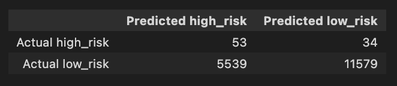
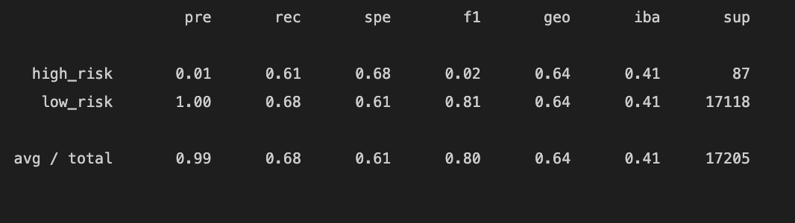
- Balanced accuracy score: 64%

`SMOTE algorithm`
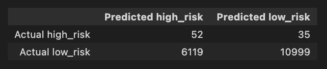
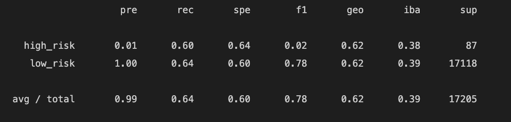
- Balanced accuracy score: 62%

# Under sampling the data

`ClusterCentroids algorithm`
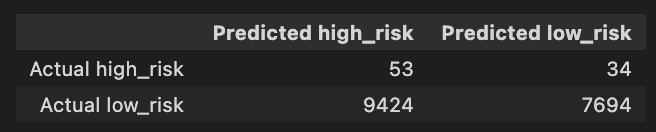
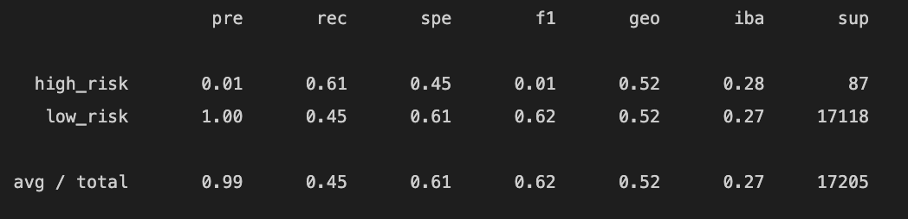
- Balanced accuracy score: 62%

# Combinatorial approach of over and under sampling

`SMOTEENN`
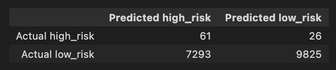
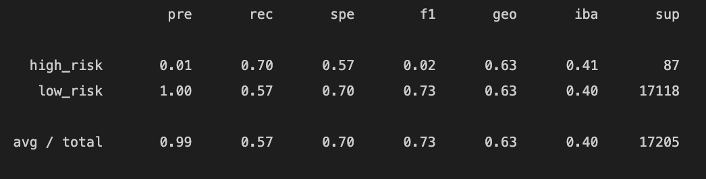
- Balanced accuracy score: 53%

# Reducing bias

`BalancedRandomForestClassifier`
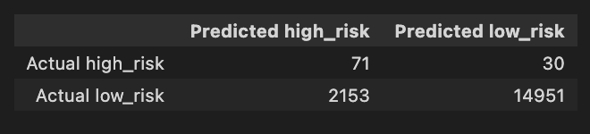
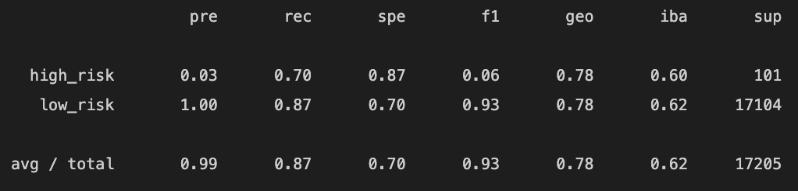
- Balanced accuracy score: 79% 

`EasyEnsembleClassifier`
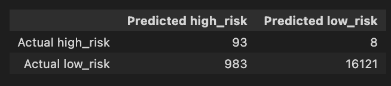
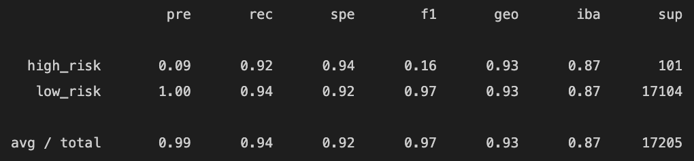
- Balanced accuracy score: 93%

# Summary

## Best overall/ balanced accuracy score
- `EasyEnsembleClassifier`is the best performing model with a balanced accuracy score of 93%.

## Best overall precision
- At 9%, `EasyEnsembleClassifier` has the highest precision in classifying high-risk individuals, compared to those models with a precision of 1% or 3%.

## Best overall recall
- The `EasyEnsembleClassifier` has the highest recall rate at 92%. This means that of those that were high-risk, 92% were correctly classified as high-risk.

Overall, `EasyEnsembleClassifier` sensitivity is very high, while the precision is very low. Clearly, this is not a useful algorithm. Nor does averaging the sensitivity and precision yield a useful figure. A pronounced imbalance between sensitivity and precision will yield a low F1 score, in this case 16%.

## Final Comments and Recommendations

Precision
- Of those that were predicted high-risk, only 9% were actually high-risk. 
- 91% of the high-risk predictions were false positives 

Sensitivity / Recall
- Of those that were actually high-risk, 92% of them were detected and properly classified as high-risk.

High precision is more important than sensitivity. Having a high precision means that predicted positives are likely true positives; but a number of other true positives may not be predicted.

### Recommendation
I do not recommend using any of these models to predict credit risk. If an individual is classified as high-risk, there is a 91% chance the individual is low risk. This large percentage can translate into a significant group of individuals that are turned down for business. 

We can assume that a small percentage of these false positive will make a claim and resolve the declined application. However, many will take their business elsewhere.

